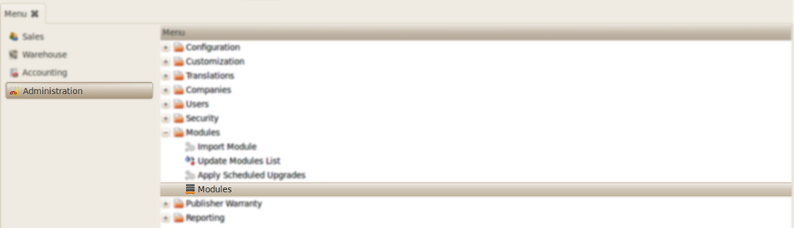
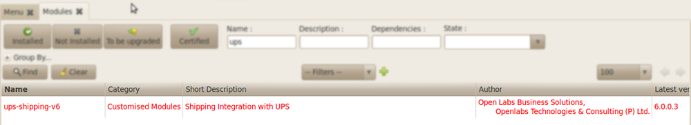

Installation
############

**Illustration 1**: *Menu to Module Installation*
"""""""""""""""""""""""""""""""""""""""""""""""""
    Copy the module to the python path of Openerp
    Go to *Administration >> Modules* and search for the module as shown below.
    

    
**Illustration 2**: *Module Selection*
""""""""""""""""""""""""""""""""""""""
    
.. image:: _images/Screenshot4.png
    :width: 1000
    
**Illustration 3**: *Installing the Module*
"""""""""""""""""""""""""""""""""""""""""""
    Install the module by clicking the Schedule For Installation.
    
.. image:: _images/Screenshot6.png
    :width: 1000
    
**Illustration 4**: *Applying the new module*
"""""""""""""""""""""""""""""""""""""""""""""
    Click on "Apply Scheduled Upgrades" to perform actual installation.
    The module with the dependency module (stock) will be installed. 
    If Stock Module is already installed, only this module will be installed.
