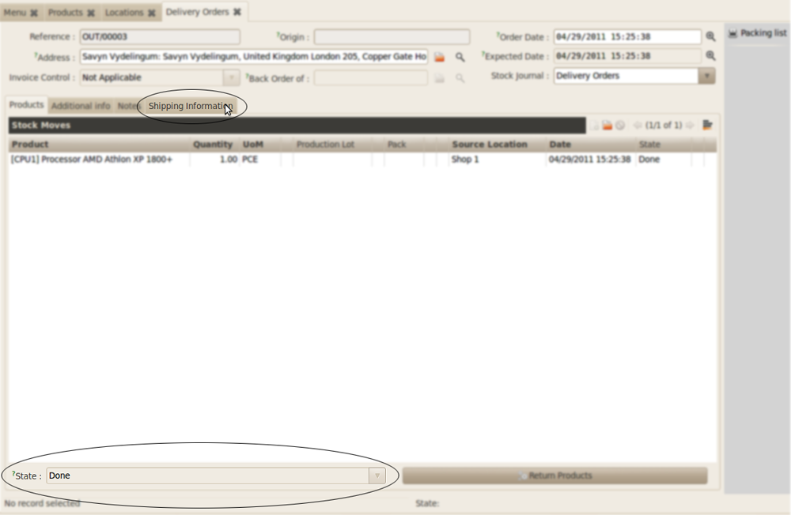
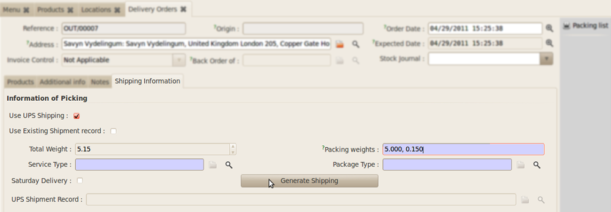

Stock Integrated Shipping Client
********************************

The module is tightly integrated with Stock Picking of OpenERP. However before 
using it with shippping some Pre-Configuration needs to be done:

Pre-Configuration
=================

All products have Net Weight. Prior to the installation of this module Net 
Weights were not manadatory.

.. image:: _images/Screenshot20.png
    :width: 1000
    
**Illustration 13**: *Sample Product Screen*
--------------------------------------------

Stock location must have an address. 

.. image:: _images/Screenshot21.png
    :width: 1000
    
**Illustration 14**: *Setting address to Stock Location as*: 
    *Warehouse >> Configuration >> Warehouse Management >> Location*
--------------------------------------------------------------------

Using with Stock Picking
========================

The Stock Picking screen will now show an extra tab for shipping information 
after products are selected and state of the picking is done.

**Illustration 15**: *Stock Picking with Shipping tab*
------------------------------------------------------

*Option 1*: Select an already created Shipping record (in the Standalone Mode) 
to the picking

.. image:: _images/Screenshot23.png
    :width: 1000

**Illustration 16**: *Associating with existing Shipping Record*.
-----------------------------------------------------------------

*Option 2*: Or choose to create a new Shipping Record from the Pre-Filled data 
in the stock move.

**Illustration 17**: *Generating new shipping from Stock Picking Information*
-----------------------------------------------------------------------------

1. *Package Weights*: Package weights indicate the various packings you may 
   have in the shipment. For example you may decide to ship a packet of 15 Kgs 
   in two packs of 10 and 5 each or 7 and 8 each. You can indicate your weights 
   by seperating them by commas as shown in the figure. By default the weight 
   is automatically computed and packs are created for each line in the picking.
   
2. *Service Type*: Refer UPS manual
   
3. *Package Type*: Refer UPS manual - All products have same picking.

On clicking *Generate Shipping* a new shipping record is created 
(just as with the standalone mode). The created record can be seen in the field 
for 'UPS Shipping Register'. And clicking the Folder Icon opens the Resource.

The created Shipping Record is in the Draft stage and is not confirmed.

It can be confirmed by clicking 'Request' then 'Accept', which generates the 
label.

The screenshots are below:

.. image:: _images/Screenshot25.png
    :width: 1000

**Illustration 18**: *Final screens of Stock after Generation of picking*.
--------------------------------------------------------------------------

