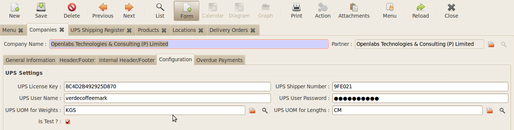

Configuration
#############

The module requires certain initial configuration to be done to set the API 
username and password.

**Illustration 5**: *Configuration of Company menu*
---------------------------------------------------

.. image:: _images/Screenshot5.png
    :width: 1000

Go to *Administration >> Companies* and open Companies. 
Set the UPS License Key, Shipper Number, UPS User-Name, UPS Password.
Tick the Is Test and fill the UOM Weights, Length field for configuration.

    
**Illustration 6**: *Setting the API*
--------------------------------------

The Module is designed to work as both a Standalone UPS Shipping and with the 
Stock Module. The two modules of working are explained in the next topic.

